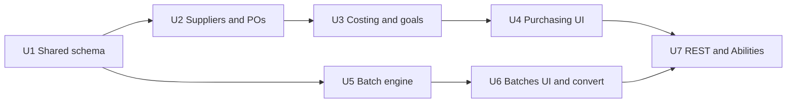

# Update Sprint Plan (Purchasing + Batching)

*Planning deliverable for `stikerts/wordpress v2/` · No plugin code in this pass*

Assumption: Phases 1–11 base plugin exists (`SOM_VERSION` ~0.11.0, `SOM_DB::DB_VERSION` **1.3.0**). Additive only.

Spec sources: `01-Update-Overview.md`, `02-Update-Data-Model.md`, `03-Update-Raw-Material-Purchasing.md`, `04-Update-Batch-Processing.md`.

---

## Settled decisions (from clarifying answers)

| Topic | Decision |
|---|---|
| Partial receipts (P1) | Keep PO `partially_received` until remaining qty received or manually closed |
| Manual close (U2) | Offer **Mark received** (accept shortfall) **or Cancel**; no stock reverse on cancel |
| Later receives (U2) | Allowed while `ordered` / `partially_received`; input = **delta this shipment** |
| Fully received (U2) | Every line `quantity_received >= quantity_ordered` (over-receive OK) |
| `received_date` (U2) | Overwrite on every successful receive |
| PO edit lock (U2) | Full edit while `ordered` with no receipts; lock lines/costs after first receive (notes still editable) |
| Receive edges (U2) | Over-receive, 0 delta (skip line), duplicate materials on one PO OK |
| `item_cost` (U2) | Total line cost (not unit price), GBP |
| Preferred supplier (U2) | Editable on material create/edit |
| Supplier delete (U2) | No delete |
| Post-receive edits (P2) | No retroactive WA rewrite — corrections via separate stock/value adjustment + new log row |
| Currency (P3) | GBP only |
| Alert surfaces (P4) | Materials badges + Product Costing only; dashboard widget later |
| `other_cost` (Q5) | Allocate like shipping; **add** `allocated_other_cost` on `purchase_order_items`; landed = `(item_cost + allocated_shipping + allocated_other) / qty_received` |
| Manual `unit_cost` (Q6) | Keep editable override — **revalue** `total_value_on_hand = current_stock × unit_cost` and write a stock-log row with `value_change` (same adjustment path as corrections) |
| Thank-you Python (B1/Q7) | 4-up already exists; this update only wires PHP batch → existing CLI |
| Mixed-product sheets (B2) | OK |
| Batch size (B3) | Both groups start at **4** |
| Gate composition (Q10) | **Batch-only steps** for v1 (no timer/script/manual combo with `batch_group_id`) |
| Existing thank-you steps (Q11) | **Auto-convert** on upgrade: set `batch_group_id`, clear per-order `script_config` |
| Schema upgrades (Q12) | **Recommendation locked:** keep existing **dbDelta + `DB_VERSION` bump**; no new migration framework. After `dbDelta`, run an explicit `ALTER TABLE` for `order_step_progress.status` ENUM (`waiting_batch`) because dbDelta is unreliable for ENUM changes. New tables/columns go in the declarative `CREATE TABLE` strings in `includes/class-som-db.php` |
| REST / MCP (Q13) | Expose suppliers, POs, batches on **`som/v1`** (CRUD where needed) and **Abilities (read-only)** per standing architecture |
| Build order (Q14) | Shared schema sprint first, then feature UIs |

---

## Spec vs codebase discrepancies (ground truth = code)

1. **Thank-you 4-up already implemented** — `stikerts/Thank you/thankyou_card.py` `render_sheet` + `thankyou_card_cli.py` accept 1–4 orders. Gap is PHP batch release calling CLI with the full list (`SOM_Local_Actions::run_thankyou_card_script` currently builds one-order JSON).
2. **No incremental ALTER migrator** — only `SOM_DB::create_tables()` + `maybe_upgrade()` version string check. Spec’s “migration step” language maps to bumping `DB_VERSION` and extending CREATE strings (+ explicit ENUM ALTER).
3. **`02-Update-Data-Model.md` has no Open items section** — only Migration notes. Open items are from 03–04 (+ codebase items below).
4. **Consumption must update value** — qty path in `SOM_Material_Stock` / `SOM_Materials::adjust_stock` must also maintain `total_value_on_hand` and log `unit_cost_at_time` / `value_change` once costing columns exist (additive extension, not a rewrite of decrement-on-create).
5. **`material_stock_log.reason` is `varchar(50)`** — adding `purchase_received` is app-level only.
6. **Base tables match** — materials, material_stock_log, products, workflow_steps, order_step_progress, workflow_templates, product_materials, orders all exist with expected columns. Workflow gates today: manual / timer / script flags; no batch gate yet.

Schema delta vs `02-Update-Data-Model.md`: add column `allocated_other_cost` on `purchase_order_items` (not in original Part A table — settled here). `batch_groups.key` is stored as DB column `group_key` (dbDelta cannot UNIQUE a reserved `key` column); PHP still exposes `->key`.

---

## 1. Consolidated open items

### From `03-Update-Raw-Material-Purchasing.md` §7

| ID | Item | Status | Blocks |
|---|---|---|---|
| P1 | Partial receipts behaviour | **Settled** — keep open as `partially_received` | — |
| P2 | Edit after receive | **Settled** — correcting adjustment only | — |
| P3 | Multi-currency | **Settled** — GBP only | — |
| P4 | Dashboard cost alerts | **Settled** — defer widget | — |
| P5 | Workflow reassignment follows new goals | **Noted** — expected; document in UI copy | None |

### From `04-Update-Batch-Processing.md` §5

| ID | Item | Status | Blocks |
|---|---|---|---|
| B1 | thankyou_card batch mode | **Settled** — Python already 4-up; PHP wires batch | — |
| B2 | Mixed-workflow cards on one sheet | **Settled** — OK | — |
| B3 | batch_size per group | **Settled** — 4 for both | — |

### Codebase / planning extras (were blocking until answered)

| ID | Item | Status |
|---|---|---|
| X1 | Schema upgrade mechanism | **Settled** — dbDelta + version bump + ENUM ALTER |
| X2 | `other_cost` column shape | **Settled** — `allocated_other_cost` |
| X3 | Gate combo with batch | **Settled** — batch-only steps |
| X4 | Auto-convert thank-you steps | **Settled** — yes on upgrade |
| X5 | REST + Abilities scope | **Settled** — REST + read-only Abilities |
| X6 | Manual `unit_cost` vs WA | **Settled** — override revalues `total_value_on_hand` |

---

## 2. Clarifying questions (kept on record)

These were asked against the specs + codebase before settling the plan. Answers are in Settled decisions above; kept here for audit trail.

1. **P1 — Partial receipts:** Keep the same PO open as `partially_received` until remaining qty is received (or manually closed), or treat first receive as final? → **Keep open.**
2. **P2 — Post-receive edits:** Confirm no retroactive WA rewrite — corrections via separate stock/value adjustment + new log row? → **Yes.**
3. **P3 — Currency:** Confirm GBP only? → **Yes.**
4. **P4 — Alerts:** Materials + Product Costing only (no dashboard widget this update)? → **Yes; widget maybe later.**
5. **`other_cost`:** Allocate like shipping and include in landed unit cost? Store how? → **Yes; add `allocated_other_cost`.**
6. **Existing `unit_cost` field:** After WA lands, stop editing `unit_cost` or keep manual override? → **Keep manual override** (revalues `total_value_on_hand`).
7. **B1 — Thank-you Python:** Treat 4-up as already done; only extend PHP to pass the full batch list into the existing CLI? → **Yes.**
8. **B2 — Mixed products on one sheet:** Confirm OK? → **OK.**
9. **B3 — Batch size:** Both `thank_you_card` and `shipping_label` start at 4? → **Yes.**
10. **Gate composition:** Batch-only step for v1, or finish per-order gates then join batch? → **Batch-only step.**
11. **Migrating existing thank-you steps:** Auto-convert on upgrade to `batch_group_id` (clear per-order script)? → **Yes, convert.**
12. **Schema upgrades:** Follow existing dbDelta + `DB_VERSION` bump (+ explicit ENUM ALTER), or invent incremental migrator? → **Recommendation locked: dbDelta + bump + ENUM ALTER.**
13. **REST / MCP:** Admin UI only, or also expose suppliers/POs/batches on `som/v1` / Abilities? → **Also expose** (REST CRUD; Abilities read-only).
14. **Sprint order:** Purchasing first, Batching first, or interleaved? → **Schema for both early, then feature UIs.**

No further blockers.

---

## 3. Sprint breakdown

Shared schema first, then Purchasing depth, then Batching (engine + UI), then API/Abilities + polish. Interleave only where natural (schema is Sprint U1).

### Sprint U1 — Shared schema upgrade

- **Covers:** Both features’ DDL; migration pattern; seed `batch_groups`; thank-you step auto-convert; suppliers domain class; material value backfill
- **Modify:** `includes/class-som-db.php` (bump `DB_VERSION` → `1.4.0`); `includes/seed/class-som-seed.php`; `orderMachine.php` (`SOM_VERSION` → `0.12.0`)
- **Create:** `includes/class-som-batch-groups.php` (ensure + thank-you convert); `includes/class-som-suppliers.php` (CRUD; admin UI still U2)
- **Schema:** 7 new tables per 02; `allocated_other_cost` on PO items; alter materials / material_stock_log / products / workflow_steps; ENUM + `waiting_batch`
- **Also:** backfill `total_value_on_hand = current_stock × unit_cost` where value still 0; auto-convert thank-you script steps → `batch_group_id` (pulled forward from U6)
- **Done when:** Fresh and upgraded installs create all tables/columns; `som_db_version` / plugin version bump; two batch groups exist; thank-you steps converted; existing material values backfilled; existing rows remain valid
- **Open items first:** none (all settled)

### Sprint U2 — Suppliers + purchase orders (domain, no full costing UI)

- **Covers:** Purchasing CRUD + receive status machine (partial receive)
- **Create:** `includes/class-som-purchase-orders.php` (`SOM_Suppliers` already shipped in U1)
- **Modify:** `orderMachine.php` requires; `admin/class-som-admin-menu.php` + views under `admin/views/` (suppliers list/edit, PO list/edit/receive); material edit for `preferred_supplier_id`; `SOM_Materials::adjust_stock` accepts `purchase_order_item_id`
- **Done when:** Can CRUD suppliers (no delete); create PO `ordered`; receive lines (delta; short → `partially_received`, all lines met → `received`); later receives; mark-received / cancel close; stock qty rises with `purchase_received` log rows (cost fields stubbed until U3); preferred supplier on materials
- **Open items first:** P1 settled; U2 clarifying answers recorded in Settled decisions

### Sprint U3 — Landed cost, weighted average, goals, preview

- **Covers:** Costing math + consumption value consistency + goals/alerts data layer + shared preview service
- **Create:** e.g. `includes/class-som-material-costing.php` (landed allocation, WA update, preview-in-memory, goal checks); `includes/class-som-workflow-material-goals.php`
- **Modify:** `includes/class-som-materials.php` (`adjust_stock` writes `unit_cost_at_time` / `value_change` / updates `total_value_on_hand`; manual `unit_cost` override revalues); `includes/class-som-material-stock.php` (consumption uses same path); PO receive in U2 class calls costing service; product helpers for recipe cost / margin
- **Done when:** Receive runs worked examples from 03 §2; preview matches receive without DB writes; consumption keeps `total_value_on_hand` consistent; goals fire approaching/over; correcting adjustment path exists (no edit-received-PO rewrite)
- **Open items first:** P2, X2, X6 settled

### Sprint U4 — Purchasing admin UI (costing surfaces)

- **Covers:** Materials enhanced, workflow goals UI, Product Costing, Preview Impact button
- **Modify:** `admin/views/materials-list.php`, `admin/views/material-edit.php`, `admin/views/product-edit.php` / products list, `admin/views/workflow-step-editor.php` or workflow templates view for goals, PO create/edit views from U2, `admin/assets` CSS/JS as needed, menu registration
- **Done when:** All UI rows from 03 §6 work (except deferred dashboard widget); Preview Impact shows WA + goal + product margin impact; alerts on Materials + Product Costing
- **Open items first:** P4 settled (no widget)

### Sprint U5 — Batch gate in workflow engine

- **Covers:** Batch Processing state machine (04 §2); batch-only step rule
- **Create:** `includes/class-som-batches.php` (collecting batch, add item, release, mark done, script run for group)
- **Modify:** `includes/class-som-workflow-engine.php` `enter_step` — if `batch_group_id` set → `waiting_batch` + enqueue (reject/ignore other gates for that step in v1); advance all members on batch done via each item’s `workflow_step_id`; `includes/class-som-local-actions.php` — batch thank-you path: build multi-order JSON, call existing CLI; `includes/class-som-workflows.php` step save validation (batch-only); script retry/backoff at batch unit
- **Done when:** Orders pool cross-workflow; auto-ready at size 4; manual release; script group runs once for all members and advances all; manual_confirm group waits for mark-done; failure leaves whole batch in `error`
- **Open items first:** B1–B3, X3 settled

### Sprint U6 — Batches admin UI + thank-you step conversion

- **Covers:** Batches page; order detail waiting_batch; step editor `batch_group_id`
- **Create:** `admin/views/batches.php` (and detail if needed)
- **Modify:** `admin/class-som-admin-menu.php`, `admin/views/order-detail.php`, `admin/views/workflow-step-editor.php`; shipping_label opt-in via editor
- **Note:** Thank-you step auto-convert shipped in **U1** (`SOM_Batch_Groups::convert_thankyou_steps`) — U6 only needs UI + editor wiring; re-run convert remains idempotent on load
- **Done when:** Batches UI matches 04 §4; order detail links to batch; step editor can assign `batch_group_id` (shipping_label opt-in)
- **Open items first:** Q11 settled (convert done in U1)

### Sprint U7 — REST + Abilities + smoke tests

- **Covers:** `som/v1` suppliers, purchase orders (+ receive/preview), workflow material goals, batches (list/get/release/mark-done); read-only Abilities mirroring safe reads
- **Modify:** `includes/class-som-rest-api.php`, `includes/class-som-abilities.php`; smoke test under `tests/` (pattern like existing sprint smokes)
- **Done when:** Authenticated REST covers CRUD/actions needed by admin flows; Abilities list/get only (no credential leakage); smoke script covers schema presence, one PO receive WA path, one batch collect→release→advance
- **Open items first:** X5 settled

---

## 4. Out of scope (explicit)

- Dashboard cost-alerts widget
- Reorder-point formula (03 §4 future)
- Reworking order sync, core three gates, or listings
- Multi-currency
- Retroactive rewrite of received POs
- Combining batch with timer/script/manual on the same step
- Rewriting thank-you card PDF layout (already 4-up)

---

## 5. Next step

This file is the planning deliverable only. **Do not** implement plugin code until asked to execute sprints U1–U7.
