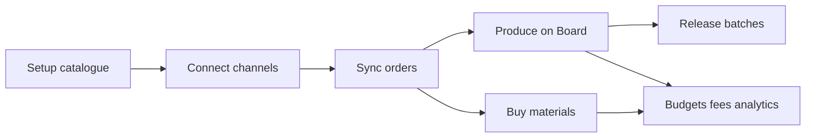

# Order Machine — User Workflows

*Step-by-step procedures for running the shop.*  
*Companion hub: [`USER-GUIDE.md`](USER-GUIDE.md) · Screen details: [`USER-REFERENCE.md`](USER-REFERENCE.md)*

Each workflow: **Goal → Where → Steps → Expected result → If it fails.**

**Local (dummy)** vs **Live (online)** callouts appear where the path differs.

---

## Workflow index

1. [First-time setup (catalogue)](#1-first-time-setup-catalogue)
2. [Connect & sync](#2-connect--sync)
3. [Morning / new-order loop](#3-morning--new-order-loop)
4. [Production day (Orders Board)](#4-production-day-orders-board)
5. [Bin-sticker style production path](#5-bin-sticker-style-production-path)
6. [Batches](#6-batches)
7. [Restock purchasing](#7-restock-purchasing)
8. [Budgets](#8-budgets)
9. [Fees & costing check](#9-fees--costing-check)
10. [Weekly health](#10-weekly-health)

---

## 1. First-time setup (catalogue)

**Goal:** Products that can match marketplace lines, reserve materials, and run a workflow.

**Where:** Materials → Products → Workflows → Listings (and optionally Budgets later).

### Steps

1. **Order Machine → Materials**  
   Create each raw material (name, unit, starting stock, low-stock threshold). Optionally set preferred supplier. Soft-deactivate instead of deleting when retiring a material.

2. **Order Machine → Workflows**  
   Create a template (e.g. “Bin Sticker Production”). In the step editor:
   - Add steps in production order; reorder as needed.
   - Toggle **requires manual confirm** and/or a **timer** (minutes / hours / days).
   - For thank-you / label style steps, assign a **batch group** only (do not combine with timer/script/manual on the same step).
   - Optionally set **material cost goals** (target / approaching) for materials used by this workflow.

3. **Order Machine → Products** → Add  
   - Name, SKU, active.  
   - Assign the **workflow template**.  
   - Edit the **material recipe** (material + quantity per unit sold).  
   - Set **target selling price** (used in costing estimates and some budget % methods when line price is empty).

4. **Order Machine → Listings**  
   Refresh listings if needed, then **link** each marketplace listing (and variations where shown) to the correct product. Unmatched future order lines stay flagged until linked.

5. **Dummy only:** If seed already created BIN-SET-4PK + workflow + materials, review them and adjust rather than recreating from scratch.

### Expected result

- Product shows recipe + workflow + Product Costing panel.  
- New **incremental** sync of a matched order will assign that workflow, reserve stock, and (if budgets exist) fund them.

### If it fails

| Problem | Likely cause |
|---|---|
| Order has no workflow after sync | Listing not linked; or order was a **history import**; or order existed before workflow was assigned |
| Invalid workflow save with batch | Batch steps must be batch-only in v1 |
| Costing looks empty | Need target price and/or recipe; fee estimates seed on admin load |

---

## 2. Connect & sync

**Goal:** Pull marketplace (or fixture) orders and optionally platform fees.

**Where:** Order Machine → Settings

### Steps — Local (dummy)

1. Confirm `SOM_USE_DUMMY_CREDENTIALS` is true and Settings shows eBay/Etsy connected.
2. Click **Sync now** → note created / updated counts.
3. Click **Sync now** again → expect **created 0** (updates only; no duplicates).
4. Optionally **Sync fees now** for fixture fee lines.
5. Avoid relying on **Import history** when you want to practise workflow + stock + budgets (history skips those).

### Steps — Live (online)

1. Save client ID + secret for eBay and/or Etsy. Register the callback URLs from Settings in each developer app.
2. **Connect** each channel; complete OAuth.
3. Set intervals if desired: order poll, engine tick, token refresh, **fee poll** (default 30 minutes, minimum 5).
4. **Sync now** for incremental new/updated orders.
5. Use **Import history** (30 or 90 days) only for backfill — those creates do **not** get workflow assignment, stock reservation, or budget funding like live new orders.
6. **Platform fee sync:** check last-run / cursor; **Sync fees now**.  
   If eBay shows a **Finances reconnect** warning, Disconnect → Connect again (refresh alone is not enough).
7. Optional: n8n base URL (for steps whose script type is n8n), MCP toggle, REST API key.

### Expected result

- Orders appear under **Orders** (and open ones on **Orders Board**).  
- Re-sync does not duplicate the same channel + external order ID.  
- Fee sync fills order **Platform fees** and/or **Recurring Platform Expenses** without duplicating the same external entry.

### If it fails

| Problem | Likely cause |
|---|---|
| OAuth fails on Local/wp-env without real apps | Use dummy mode, or use a public URL + real apps for live OAuth |
| Sync fees inserts 0 forever | Already synced those entries, or eBay token missing Finances scope |
| Decrypt / ciphertext errors | `SOM_ENCRYPTION_KEY` changed after save — reconnect |

---

## 3. Morning / new-order loop

**Goal:** See what arrived overnight, fix matching issues, know what is ready to produce.

**Where:** Settings (optional Sync) → Orders → Listings (if unmatched)

### Steps

1. **Settings → Sync now** (or rely on cron if intervals are set). Live: also glance at fee sync status if you care about actual fees that day.
2. **Orders** — scan badges: open, complete, cancelled, **unmatched items**, **no workflow**.
3. Filter by channel / status / date / search as needed.
4. Open each **unmatched** or **no workflow** order:
   - Note the listing ID / title on the line.
   - **Listings** → link that listing to the correct product (helps **future** syncs).  
   - Existing open orders do not always self-heal; you may need to handle production manually or wait for new creates after linking.
5. Open a **matched** order and confirm personalisation, address, line items, and current workflow step look right for packing.
6. Jump to **Orders Board** for the day’s production queue (Workflow 4).

### Expected result

- You know which orders need catalogue fixes vs which can move on the Board.  
- Cancelled orders are visible but not treated as new stock reservations.

### If it fails

| Problem | Likely cause |
|---|---|
| Expected new order missing | Sync not run; wrong channel connected; order outside poll window |
| Unmatched after linking listing | Link helps new syncs; this order may already be stored unmatched |

---

## 4. Production day (Orders Board)

**Goal:** Move open orders through steps with filters, pins, and gated drag-and-drop.

**Where:** Order Machine → Orders Board

### Steps

1. Open **Orders Board**. Only **incomplete, non-cancelled** orders appear. Use **View history** / **Orders** for completed work.
2. Columns are current step names (+ **Unassigned** if any open order has no current step). Empty next-step columns may be prefilled so you have a drop target.
3. Optionally reorder columns with **← / →** on headers (saved per user). Pin important cards with ★; filter **Pinned only**.
4. Filter by channel, product, workflow template, or free-text (buyer / external ID / personalisation).
5. Advance work:
   - **Drag** a card only when it could **Mark done** (in progress and gates clear). Drop on the **next** step column, or the ephemeral **Complete** zone on the last step.
   - Waiting (timer / script / batch), error, pending, and Unassigned cards stay **locked**.
   - Invalid drop or API error → card snaps back.
6. Use **order ID**, **product name**, or **View** links for detail — the card body is not one big link.
7. When a card shows **waiting_batch**, follow the batch link (Workflow 6) instead of dragging.

**Alternative:** On **Orders → order detail**, use **Mark done** when the UI allows (same gate rules; hidden while `waiting_batch`).

### Expected result

- Cards move only when the step is actually advanceable.  
- Completing the last step removes the card from the Board (`is_complete`).

### If it fails

| Problem | Likely cause |
|---|---|
| No drag handles / DnD missing | SortableJS CDN blocked (offline admin) |
| Snap-back | Wrong column (not next step) or advance failed |
| ≥200 / 500 open orders | Volume warning / hard cap — oldest kept when capped; tighten filters |

---

## 5. Bin-sticker style production path

**Goal:** Walk a typical sticker order from Print through thank-you batch and review (matches the seeded **Bin Sticker Production** template).

**Where:** Order detail and/or Orders Board → Batches

### Seeded step map

| # | Step | How it advances |
|---|---|---|
| 1 | Print | Manual confirm |
| 2 | Dry | Timer (e.g. 15 minutes) then Mark done / drag |
| 3 | Laminate | Manual |
| 4 | Cut | Manual |
| 5 | Pack | Manual |
| 6 | Ship | Manual (optionally assign `shipping_label` batch group via workflow editor) |
| 7 | Thank-you | **Batch** `thank_you_card` — wait for batch release/script |
| 8 | Review reminder | Timer (e.g. 7 days) + manual |

### Steps

1. Start from a **matched** open order with this workflow (after Sync on a product that has the template assigned).
2. **Print** — Mark done or drag to Dry.
3. **Dry** — Mark done stays blocked until the timer ends (engine tick unlocks). Then advance to Laminate.
4. Continue **Laminate → Cut → Pack → Ship** with manual confirms (Board drag or Mark done).
5. On **Thank-you**, status becomes **waiting_batch**. Mark done is hidden on the order. Open **Batches** (Workflow 6).
6. After the thank-you batch completes, the order advances toward **Review reminder**; complete when the timer and manual gate allow.

### Expected result

- Personalisation and address stay visible on order detail for packing.  
- Thank-you runs once for the whole batch (not per order alone).

### If it fails

| Problem | Likely cause |
|---|---|
| No progress rows | Unmatched / no primary product / history import |
| Stuck on Dry | Timer still running |
| Stuck on Thank-you | Batch not released / not full / script error — use Batches |

---

## 6. Batches

**Goal:** Release or complete multi-order batch steps (thank-you cards, shipping labels).

**Where:** Order Machine → Batches (`batch_id` deep-links from order detail)

### Steps

1. Open **Batches**. Default list is open statuses: collecting / ready / processing / error (optionally include done).
2. Expand a batch to see members (buyer, order ref; address on expand).
3. When enough orders share the same batch group:
   - Auto-**ready** when batch size is reached, **or**
   - Manual **Release** while still collecting.
4. **Script** groups (e.g. thank_you_card): Release runs processing and the script once for all members, then advances them.
5. **Manual confirm** groups (e.g. shipping_label): Release, then **Mark done** on the batch to advance members.
6. On **error**, member progress shows error; use **Retry** to re-enter processing.
7. Optionally edit a batch group’s **display name** / **batch size** on the same page (`group_key` and action type stay fixed).

**Note:** Cancelled orders may remain listed in a collecting/ready batch but are skipped on advance.

### Expected result

- All successful members move to the next workflow step together.  
- Order detail while waiting shows a link to this batch and hides Mark done.

### If it fails

| Problem | Likely cause |
|---|---|
| Script batch errors | Check `last_error`; Retry; confirm local/script path still valid |
| Orders not pooling | Different batch group on the step; or not yet on that step |

---

## 7. Restock purchasing

**Goal:** Buy materials, see cost impact before committing, receive stock, update WA and budgets.

**Where:** Suppliers → Purchase Orders → Materials / Budgets

### Steps

1. **Suppliers** → create or edit supplier (name, contact, notes). There is **no delete**.
2. **Purchase Orders** → create PO:
   - Supplier, order date, shipping cost, other cost.
   - Lines: material, qty ordered, **item cost** = total line cost in GBP (duplicate materials on one PO are OK).
3. On create/edit, click **Preview Impact** to see projected WA, goal alerts, and product margin impact **without** saving to stock.
4. Save with status **ordered**.
5. When goods arrive → **Receive**:
   - Enter **delta this shipment** per line (0 skips a line).
   - Short receipt → `partially_received`; all lines fully received → `received` (over-receive allowed).
   - Later receives allowed while ordered / partially received.
6. Alternatives:
   - **Mark received** — close with shortfall (does **not** draw down budgets for the missing qty).
   - **Cancel** — close without reversing stock already received.
7. After the first successful receive, line/cost fields **lock**; notes remain editable.
8. Check **Materials** for updated stock, WA, value on hand, goal badges, and purchase history. If a material budget exists, check **Budgets** for `purchase_spend` ledger rows.

### Expected result

- Stock rises with reason purchase received.  
- Landed unit cost updates WA.  
- Active material budgets draw down by `delta × landed unit cost` on receive (not on mark-received shortfall alone).

### If it fails

| Problem | Likely cause |
|---|---|
| WA unchanged | Total line `item_cost` is 0 (shipping/other not allocated); or you only previewed |
| Can’t edit lines | Already received once |
| Budget unchanged after stock rose | No active material budget; mark-received shortfall; or rare ledger write failure (stock kept — fix with manual budget adjustment) |

---

## 8. Budgets

**Goal:** Hold money aside from sales for materials or other pots; spend on PO receive or R&D.

**Where:** Order Machine → Budgets (also R&D on Materials edit)

### Steps — create

1. **Budgets → Add**
2. Choose type (fixed after create):
   - **Material** — one budget per material; funds from consumption cost on new orders. Optional workflow checkboxes (empty = all workflows). Scope is **order-level** via the primary product’s workflow.
   - **Manual** — funding method: `% of price`, `% of profit` (fee-aware), or **fixed amount** per unit. Optional product checkboxes (empty = all products).
3. Set name, notes, target reserve, active flag.

### Steps — day to day

1. After **Sync now** creates a matched order with stock applied, open the budget → ledger should show **sale_funding** (idempotent on re-sync).
2. After **PO receive**, material budgets show **purchase_spend** (negative).
3. **Manual adjustment** — notes required; can push balance up or down.
4. **R&D / non-sale write-off** (budget detail or material edit) — reduces stock and, if an active material budget exists, debits it. Plain **Adjust stock** on Materials does **not** touch budgets.
5. Deactivate a budget to stop further funding / draw-down without deleting history.

### Expected result

- List badges: low balance (below target reserve), overspent (balance &lt; 0).  
- `percent_of_profit` uses the same estimate→actual fee rule as Costing; loss-making orders may fund a **negative** amount.

### If it fails

| Problem | Likely cause |
|---|---|
| No funding on sync | History import; cancelled; inactive; scope miss; already funded; unmatched (no stock path) |
| `%` used target when line shows £0 | Unexpected — sold price **0** is treated as set; only empty falls back to target |
| Adjust stock didn’t hit budget | Use R&D write-off |

---

## 9. Fees & costing check

**Goal:** Keep fee estimates honest, sync actual fees, and read Product Costing / order fees.

**Where:** Channel Fee Estimates → Settings (fee sync) → order detail → Products → Recurring Platform Expenses

### Steps

1. **Channel Fee Estimates** — review seeded eBay/Etsy components (tiers, optional ads). Edit rates, enable/disable, add/delete custom rows. Seeds do not overwrite your edits.
2. **Settings → Sync fees now** (or wait for fee cron).  
   - **Dummy:** fixtures populate order fees / recurring expenses.  
   - **Live:** eBay Finances + Etsy Ledger; reconnect eBay if Finances scope is missing.
3. Open an order that should have fees → **Platform fees** panel lists actual lines when synced.
4. **Recurring Platform Expenses** — listing-style fees not tied to an order; filter by channel / listing.
5. **Products →** open a product → **Product Costing**:
   - Per-channel **estimated** fees £ + % and fee-aware profit.
   - After enough actuals, **Actual fees** with order count; variance highlight when roughly ≥2 percentage points off.
   - Linked listing can switch the representative price toward listing price for that channel.
6. Products list margin badge shows Est. fees / Actual fees.

### Expected result

- Profit and budget `% of profit` share the same fee math.  
- Recurring expenses appear on their own screen; they are **not** included in Analytics profit charts.

### If it fails

| Problem | Likely cause |
|---|---|
| No fee estimate rows | Open admin so defaults seed; or wrong channel |
| Costing still “materials only” looking | Expand per-channel fee table; labels are Est./Actual |
| Duplicate fee worry | Re-sync is idempotent on external entry IDs |

---

## 10. Weekly health

**Goal:** Spot sales, profit, stock, and money pressure without deep diving every day.

**Where:** Analytics → Materials → Budgets → Recurring Platform Expenses → (optional) Channel Fee Estimates

### Steps

1. **Analytics** — pick a range (7 / 30 / 90 / this year / custom), granularity, and channel filter.
2. Read **Sales**, **Profit** (fee-aware; cancelled / refunded excluded), **Orders by channel**, **AOV**.
3. Select materials → **Apply** for the stock-over-time chart (empty until you select).
4. **Materials** — low-stock highlighting; goal-alert badges after expensive receives.
5. **Budgets** — low balance / overspent; skim recent ledger if something looks off.
6. **Recurring Platform Expenses** — glance at listing fees and similar.
7. If margins look wrong, return to Workflow 9 (estimates vs Sync fees vs Product Costing).

### Expected result

- A short weekly picture of revenue, fee-aware profit, stock trajectory, and budget health.  
- Stock chart only after material multi-select + Apply.

### If it fails

| Problem | Likely cause |
|---|---|
| Charts empty | No `unit_price` on lines; date range; CDN blocked |
| Profit “too high” | Actual fees not synced yet — estimates still used; recurring expenses excluded by design |

---

## Related docs

- [`USER-GUIDE.md`](USER-GUIDE.md) — setup paths, glossary, limits  
- [`USER-REFERENCE.md`](USER-REFERENCE.md) — per-screen reference  
- [`FEATURES-AND-TESTING.md`](FEATURES-AND-TESTING.md) — full feature + test guide
